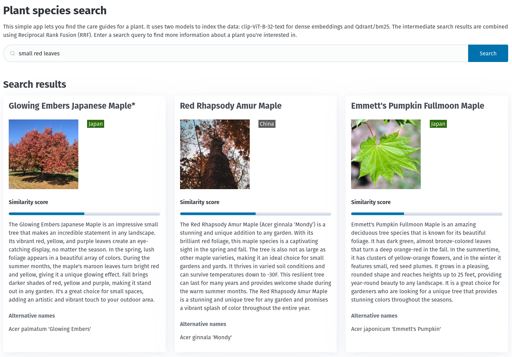

# template-hybrid-search-fasthtml

This repository is a template for building a hybrid search application using Qdrant as a search engine and FastHTML to
build a web interface. The demo application is a simple search engine for the plant species dataset obtained from the
[Perenual Plant API](https://perenual.com/docs/api).



## Installation

Please make sure you have [poetry](https://python-poetry.org/) installed on your system. Then run the following
commands to install the dependencies:

```bash
poetry install
```

## Configuration

The main application requires a running Qdrant instance. You can set it up locally using Docker, however the easiest way
is to use the [Qdrant Cloud](https://cloud.qdrant.io/). There is a free forever 1GB cluster available. Please refer to
the [Qdrant documentation](https://qdrant.tech/documentation/quickstart-cloud/) for more information on how to set up
the cluster and get the API key.

Once you have the API key, you can set it up in the `.env` file (please check `.env.example` for more details):

```dotenv
# Perenual API provides the data for the project. The API key is required to access the data.
# Please uncomment only if you want to perform the data collection from the Perenual API on your own.
# Otherwise, you should be fine with using the scripts/index-data.py script to load the data from the data/ directory.
# PERENUAL_API_KEY="<<PERENUAL_API_KEY>>"

QDRANT_URL="<<QDRANT_URL>>"
QDRANT_API_KEY="<<QDRANT_API_KEY>>"
COLLECTION_NAME="plant-species"
```

## Data loading

The application requires the data to be loaded into the Qdrant collection. The data is stored in the `data` directory.
You can load the data using the following command:

```bash
poetry run python scripts/index-data.py
```

This script will load the data into the Qdrant collection. The collection name is defined in the `.env` file.

## Running the application

Our FastHTML application uses a built-in server, and you can run it using the following command:

```bash
poetry run python src/main.py
```

The application will be available at [http://localhost:5001](http://localhost:5001).

### Technical details

The application uses dense and sparse embedding models to search for the plant species:

- dense model: [`Qdrant/clip-ViT-B-32-text`](https://huggingface.co/Qdrant/clip-ViT-B-32-text)
- sparse model: [`Qdrant/bm25`](https://huggingface.co/Qdrant/bm25)

Results are combined with Reciprocal Rank Fusion (RRF) to provide the best of both worlds. This is possible with the
Qdrant [Query API](https://qdrant.tech/documentation/concepts/search/#query-api) available starting from version 1.10.0.
